# 3. Design

**김호현 (22212005)**
xoickh5123@naver.com

---

## Revision History

| Date | Version | Description | Author |
|------|---------|-------------|--------|
| 2026-06-05 | 1.0 | First Writing | 김호현 |

---

## Contents

1. Introduction
2. Class Diagram
3. Sequence Diagram
4. State Machine Diagram
5. Implementation Requirements
6. Glossary
7. References

---

## 1. Introduction

### 1) Summary

지난 Analysis 문서에서는 시스템이 '무엇을 하는가'에 초점을 맞춰 Use Case를 중심으로 요구사항을 분석했다. 본 Design 문서는 그 내용을 토대로 각 기능을 '어떻게 구현할 것인가'에 대해 다룬다. 이를 위해 클래스 다이어그램, 시퀀스 다이어그램, 상태 머신 다이어그램을 그리고 각각에 설명을 덧붙였다. Analysis 문서에서 정리한 요구사항을 실제 구현 단위로 한 단계 더 구체화하였다.

Time-Share Bank는 돈이 아니라 시간 포인트를 매개로 이웃끼리 재능과 도움을 주고받는 위치 기반 플랫폼이다. GPS로 가까운 사용자를 매칭해주고, 시간 포인트를 주고받으며, 도움을 제공하거나 요청하는 글을 올릴 수 있다. 또한 플랫폼을 안전하게 유지하기 위한 관리자 기능도 둔다. 주 사용자는 1인 가구나 같은 동네에 사는 지역 주민이며, 모바일 앱 형태로 개발한다.

### 2) Important Points of Design

- 시스템은 사용자 권한(일반 사용자, 관리자)에 따라 사용 가능한 기능과 operation을 구별한다.
- 모든 시간 포인트 거래는 서비스 완료 후 양측 사용자의 확인을 거쳐 포인트가 지급되며, 이를 통해 데이터 무결성을 보장한다.
- GPS 위치 데이터는 지역 등록 및 실시간 매칭에 활용되며, 적절한 권한 관리와 함께 처리되어야 한다.
- 클래스 간의 정보 공유는 허용하되, 캡슐화 원칙에 따라 외부로의 불필요한 노출을 최소화한다.
- 허위 거래를 통한 포인트 부정 수급(어뷰징)을 방지하기 위해, 거래 정산 시 GPS 근접 여부 확인 및 증빙 사진 첨부 기능을 보조 수단으로 도입한다.
- 전체 시스템은 클라이언트-서버 구조를 따르며, 모바일 클라이언트는 UI 및 로컬 로직을 담당하고 서버는 사용자 데이터, 게시글, 포인트 거래를 관리한다.

---

## 2. Class Diagram

아래는 Time-Share Bank 시스템의 전체 클래스 다이어그램이다. Conceptualization 단계에서 도출한 Use Case를 기반으로 클래스를 추출하였으며, 사용자 권한(일반 사용자, 관리자)에 따른 기능 분리와 시간 포인트 거래의 무결성을 중심으로 설계하였다.

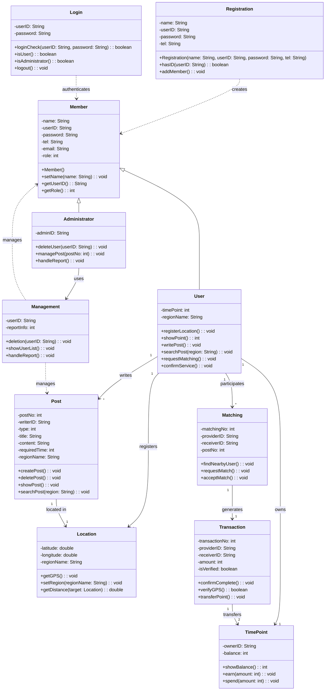

아래에서 각 클래스를 상세히 설명한다.

### 1) Member

시스템의 모든 사용자가 공통으로 가지는 정보를 담는 부모 클래스이다. User와 Administrator가 이를 상속한다.

**Attributes**

| Name | Type | Description |
|------|------|-------------|
| name | String | 사용자 이름 |
| userID | String | 사용자 ID |
| password | String | 비밀번호 |
| tel | String | 전화번호 |
| email | String | 이메일 주소 |
| role | int | 사용자 권한 (0: 일반 사용자, 1: 관리자) |

**Methods**

| Name | Return | Description |
|------|--------|-------------|
| Member() | - | 생성자 |
| setName(name: String) | void | 이름 설정 |
| getUserID() | String | ID 반환 |
| getRole() | int | 권한 반환 |

### 2) Registration

회원가입 기능을 담당하는 클래스이다. 입력받은 정보로 신규 회원을 생성한다.

**Attributes**

| Name | Type | Description |
|------|------|-------------|
| name | String | 가입자 이름 |
| userID | String | 가입자 ID |
| password | String | 비밀번호 |
| tel | String | 전화번호 |

**Methods**

| Name | Return | Description |
|------|--------|-------------|
| Registration(name, userID, password, tel) | - | 회원가입 생성자 |
| hasID(userID: String) | boolean | 입력한 ID가 이미 존재하는지 확인 |
| addMember() | void | 신규 회원 추가 |

### 3) Login

로그인 및 사용자 인증을 담당하는 클래스이다. ID와 비밀번호 일치 여부를 확인하고, 사용자의 권한을 판별한다.

**Attributes**

| Name | Type | Description |
|------|------|-------------|
| userID | String | 로그인 ID |
| password | String | 로그인 비밀번호 |

**Methods**

| Name | Return | Description |
|------|--------|-------------|
| loginCheck(userID, password) | boolean | ID와 비밀번호 일치 여부 확인 |
| isUser() | boolean | 일반 사용자 여부 판별 |
| isAdministrator() | boolean | 관리자 여부 판별 |
| logout() | void | 세션 종료 및 로그아웃 처리 |

### 4) User

일반 사용자를 나타내는 클래스로, Member를 상속한다. 지역 등록, 포인트 조회, 게시글 작성, 매칭 요청 등 핵심 기능을 수행한다.

**Attributes**

| Name | Type | Description |
|------|------|-------------|
| timePoint | int | 보유 시간 포인트 |
| regionName | String | 등록된 지역명 |

**Methods**

| Name | Return | Description |
|------|--------|-------------|
| registerLocation() | void | GPS 기반 지역 등록 |
| showPoint() | int | 보유 포인트 조회 |
| writePost() | void | 재능/도움 게시글 등록 |
| searchPost(region: String) | void | 지역 기반 게시글 탐색 |
| requestMatching() | void | 가까운 사용자에게 매칭 요청 |
| confirmService() | void | 서비스 완료 확인 |

### 5) Administrator

관리자를 나타내는 클래스로, Member를 상속한다. 사용자 및 게시글 관리, 신고 처리 등 플랫폼 안전 관리 기능을 수행한다.

**Attributes**

| Name | Type | Description |
|------|------|-------------|
| adminID | String | 관리자 ID |

**Methods**

| Name | Return | Description |
|------|--------|-------------|
| deleteUser(userID: String) | void | 사용자 정보 삭제 |
| managePost(postNo: int) | void | 부적절한 게시글 관리 |
| handleReport() | void | 신고 내역 처리 |

### 6) Location

GPS 기반 위치 정보를 관리하는 클래스이다. 지역 등록과 실시간 매칭 시 사용자 간 거리 계산에 활용된다.

**Attributes**

| Name | Type | Description |
|------|------|-------------|
| latitude | double | 위도 |
| longitude | double | 경도 |
| regionName | String | 지역명 |

**Methods**

| Name | Return | Description |
|------|--------|-------------|
| getGPS() | void | 현재 GPS 좌표 획득 |
| setRegion(regionName: String) | void | 지역 정보 설정 |
| getDistance(target: Location) | double | 대상과의 거리 계산 |

### 7) TimePoint

사용자의 시간 포인트를 관리하는 클래스이다. 포인트 적립과 사용 내역을 처리한다.

**Attributes**

| Name | Type | Description |
|------|------|-------------|
| ownerID | String | 포인트 소유자 ID |
| balance | int | 보유 포인트 잔액 |

**Methods**

| Name | Return | Description |
|------|--------|-------------|
| showBalance() | int | 포인트 잔액 조회 |
| earn(amount: int) | void | 포인트 적립 |
| spend(amount: int) | void | 포인트 차감 |

### 8) Post

재능 제공 또는 도움 요청 게시글을 나타내는 클래스이다.

**Attributes**

| Name | Type | Description |
|------|------|-------------|
| postNo | int | 게시글 번호 |
| writerID | String | 작성자 ID |
| type | int | 게시글 종류 (0: 도움 요청, 1: 재능 제공) |
| title | String | 게시글 제목 |
| content | String | 게시글 내용 |
| requiredTime | int | 예상 소요 시간 (시간 포인트 단위) |
| regionName | String | 게시 지역 |

**Methods**

| Name | Return | Description |
|------|--------|-------------|
| createPost() | void | 게시글 등록 |
| deletePost() | void | 게시글 삭제 |
| showPost() | void | 게시글 상세 보기 |
| searchPost(region: String) | void | 지역 기반 게시글 검색 |

### 9) Matching

위치 기반 실시간 매칭을 담당하는 클래스이다. 가까운 거리의 제공자와 수혜자를 연결한다.

**Attributes**

| Name | Type | Description |
|------|------|-------------|
| matchingNo | int | 매칭 번호 |
| providerID | String | 재능/도움 제공자 ID |
| receiverID | String | 도움 수혜자 ID |
| postNo | int | 관련 게시글 번호 |

**Methods**

| Name | Return | Description |
|------|--------|-------------|
| findNearbyUser() | void | 현재 위치에서 가장 가까운 도움 가능자 조회 |
| requestMatch() | void | 매칭 요청 |
| acceptMatch() | void | 매칭 수락 |

### 10) Transaction

시간 포인트 정산을 담당하는 클래스이다. 서비스 완료 후 양측 확인과 GPS 검증을 거쳐 포인트를 이체하여 부정 수급을 방지한다.

**Attributes**

| Name | Type | Description |
|------|------|-------------|
| transactionNo | int | 거래 번호 |
| providerID | String | 포인트를 받는 제공자 ID |
| receiverID | String | 포인트를 지불하는 수혜자 ID |
| amount | int | 거래 포인트 양 |
| isVerified | boolean | 양측 상호 확인 여부 |

**Methods**

| Name | Return | Description |
|------|--------|-------------|
| confirmComplete() | void | 서비스 완료 상호 확인 |
| verifyGPS() | boolean | GPS 근접 여부 검증 (어뷰징 방지) |
| transferPoint() | void | 검증 후 포인트 이체 |

### 11) Management

관리자가 사용하는 사용자 및 게시글 관리 클래스이다.

**Attributes**

| Name | Type | Description |
|------|------|-------------|
| userID | String | 관리 대상 사용자 ID |
| reportInfo | int | 신고 정보 |

**Methods**

| Name | Return | Description |
|------|--------|-------------|
| deletion(userID: String) | void | 사용자 정보 삭제 |
| showUserList() | void | 전체 사용자 목록 조회 |
| handleReport() | void | 신고 접수 및 제재 처리 |

---

## 3. Sequence Diagram

이 장에서는 Conceptualization 단계에서 도출한 Use Case 각각에 대한 시퀀스 다이어그램을 그리고 설명한다. 시스템의 화면 흐름과 객체 간 메시지 전달을 표현하였으며, 클래스 다이어그램에서 정의한 operation이 어떻게 사용되는지를 중심으로 작성하였다.

### 1) 회원가입

사용자가 회원 정보를 입력하면 이미 가입된 정보인지 확인한 후, 중복되지 않으면 신규 회원을 등록하고 가입 완료 메시지를 출력한다. 이미 존재하는 ID일 경우 다른 ID 입력을 요청한다.

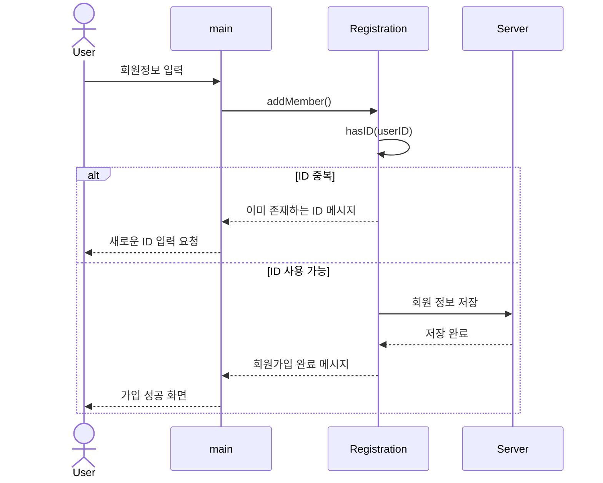

### 2) 로그인

사용자가 ID와 비밀번호를 입력하면 loginCheck를 통해 인증을 수행한다. 인증에 실패하면 error 메시지를 출력하고, 성공하면 권한(일반 사용자 / 관리자)을 판별하여 해당 메인 화면으로 전환한다.

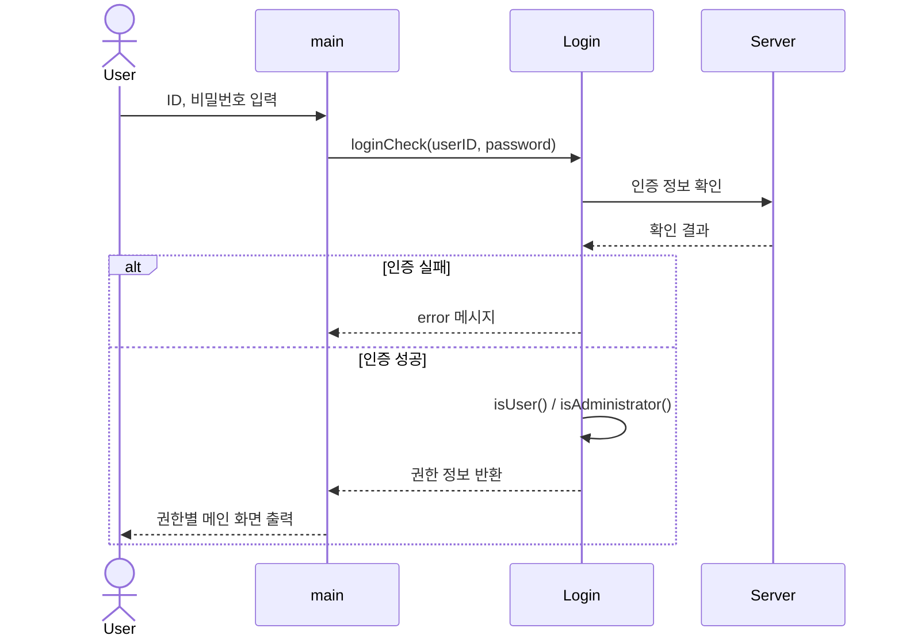

### 3) 로그아웃

로그인 상태의 사용자가 로그아웃을 요청하면 세션을 종료하고 로그인 화면으로 전환한다.

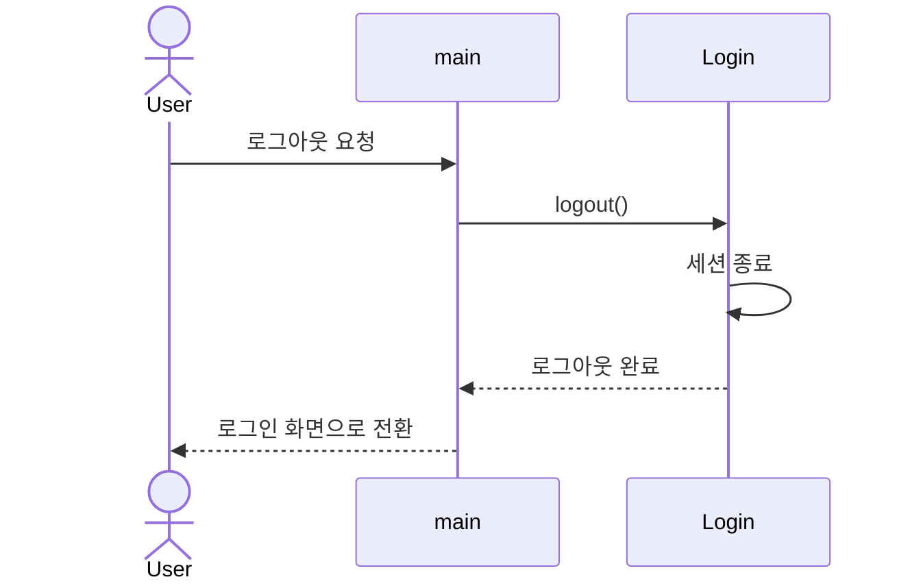

### 4) 지역 등록

사용자가 지역 등록을 요청하면 GPS를 통해 현재 위치 좌표를 획득하고, 지역명을 설정하여 서버에 저장한다.

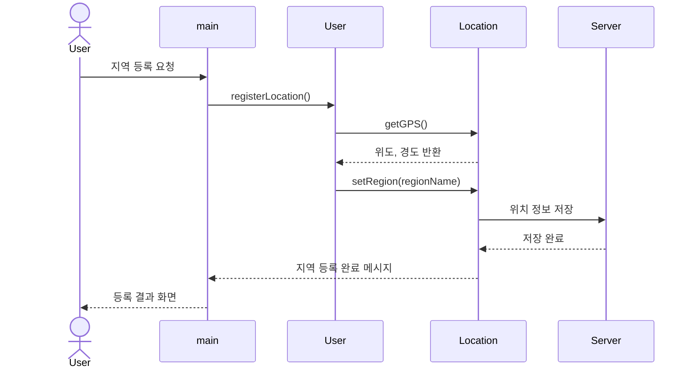

### 5) 포인트 조회

사용자가 포인트 조회를 요청하면 TimePoint에서 보유 잔액을 가져와 화면에 출력한다.

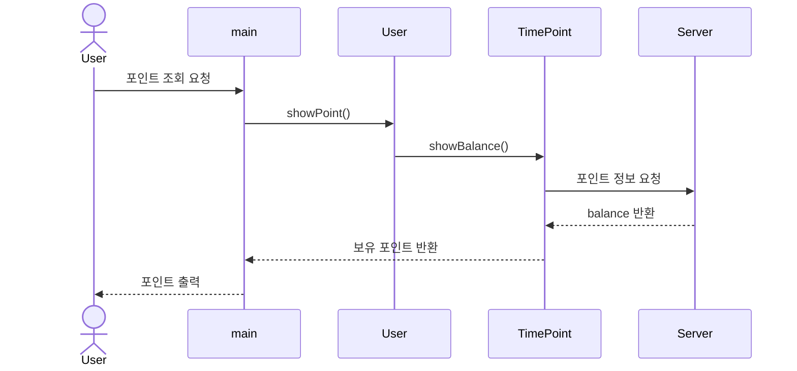

### 6) 재능/도움 게시글 등록

사용자가 게시글 정보(제목, 내용, 소요 시간 등)를 입력하면 Post를 생성하여 서버에 저장하고 등록 완료 메시지를 출력한다.

### 7) 재능/도움 게시글 탐색

사용자가 게시글 탐색을 요청하면 자신의 등록 지역을 기반으로 게시글을 검색하여 리스트로 출력한다. 검색 결과가 없으면 안내 메시지를 출력한다.

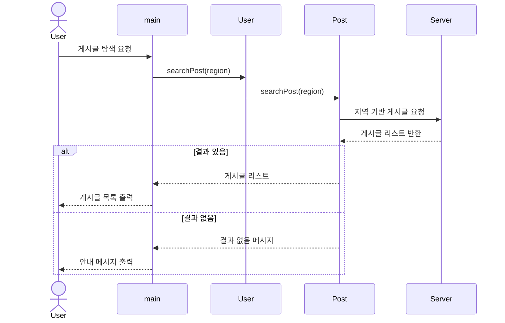

### 8) 위치 기반 실시간 매칭

사용자가 매칭을 요청하면 현재 위치를 기준으로 가장 가까운 도움 가능자를 조회하고, 매칭 요청을 전송한다. 상대방이 수락하면 매칭이 성립된다.

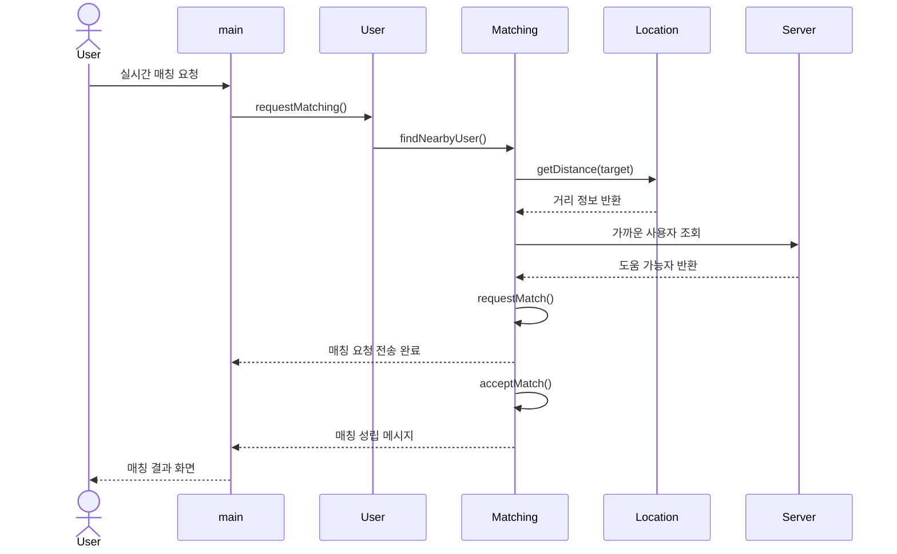

### 9) 시간 포인트 정산

서비스 완료 후 양측 사용자가 완료를 확인하면, GPS 근접 여부를 검증하여 어뷰징을 방지한 뒤 포인트를 이체한다. 검증에 실패하면 정산을 거부한다.

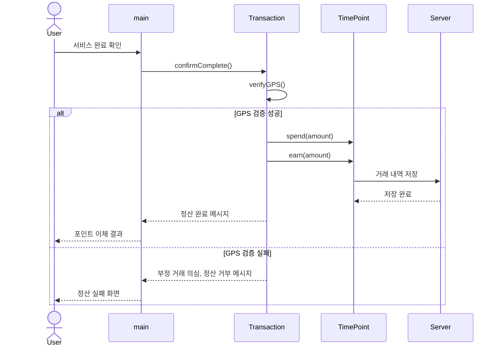

### 10) 사용자 신원 및 게시글 관리

관리자로 로그인한 후 신고된 사용자나 부적절한 게시글을 관리한다. 사용자 삭제 또는 게시글 제재를 수행하고, 사용자 목록을 조회할 수 있다.

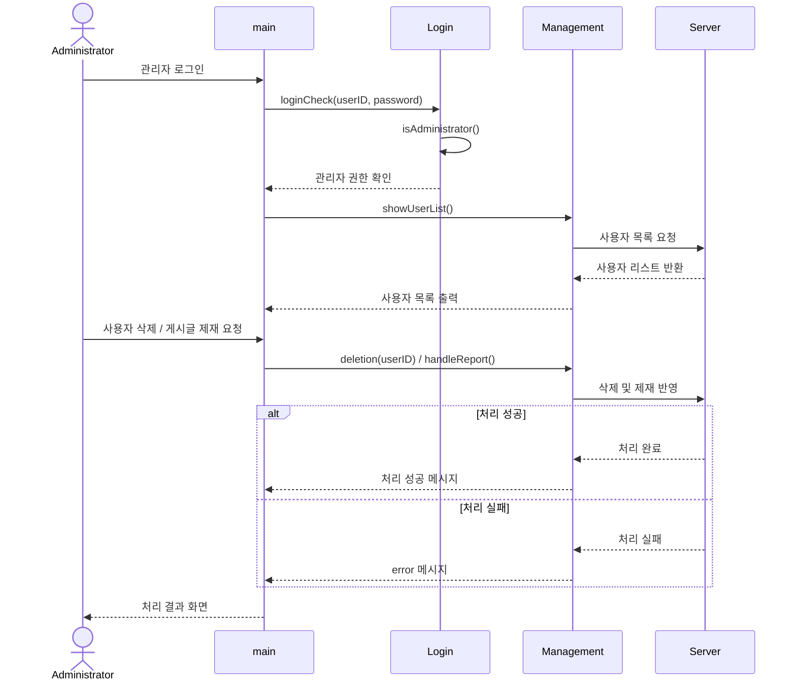

---

## 4. State Machine Diagram

이 장에서는 시스템을 클라이언트와 서버 두 관점으로 나누어 상태 머신 다이어그램을 작성한다. 클라이언트는 사용자에게 보이는 화면의 전환을 중심으로, 서버는 요청을 받아 처리하는 상태를 중심으로 표현하였다.

### 1) Client State Machine Diagram

클라이언트는 사용자와의 상호작용이 중요한 모바일 애플리케이션이므로, 행동에 대한 결과를 '보이는 화면'으로 정의하였다. 앱 실행 후 로그인 화면에서 시작하며, 인증 성공 시 권한에 따라 일반 사용자 화면 또는 관리자 화면으로 분기한다.

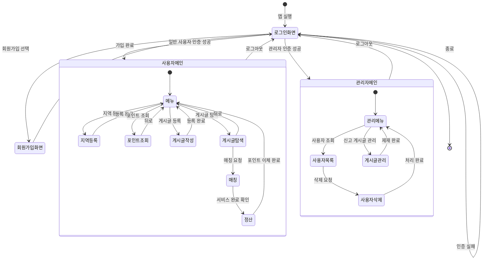

앱을 시작하면 로그인 화면이 가장 먼저 나타난다. 회원가입 화면으로 이동해 계정을 생성할 수 있으며, 인증에 성공하면 권한에 따라 화면이 분기된다. 일반 사용자는 지역 등록, 포인트 조회, 게시글 작성/탐색, 매칭, 정산 기능을 화면 전환을 통해 사용하고, 관리자는 사용자 목록 조회 및 삭제, 게시글 관리를 수행한다. 어느 화면에서든 로그아웃 시 로그인 화면으로 돌아간다.

### 2) Server State Machine Diagram

서버는 클라이언트의 요청을 대기하다가 요청 종류에 따라 적절한 처리 상태로 전이한다. 특히 포인트 정산 요청의 경우 GPS 검증 상태를 거쳐 무결성을 확인한 뒤에만 거래를 확정한다.

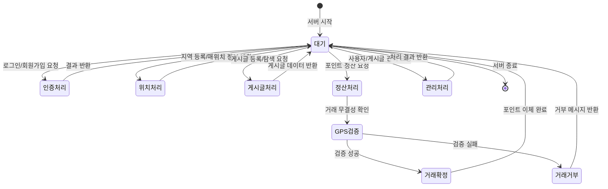

서버는 평소 대기 상태로 클라이언트의 요청을 기다린다. 인증, 위치, 게시글, 관리 요청은 해당 처리 상태로 전이한 뒤 결과를 반환하고 다시 대기 상태로 돌아간다. 포인트 정산 요청은 GPS 검증 상태를 반드시 거치며, 검증에 성공한 경우에만 거래가 확정되어 포인트가 이체되고, 실패할 경우 부정 거래로 간주하여 거래를 거부한다.

---

## 5. Implementation Requirements

본 시스템은 안드로이드 기반 모바일 애플리케이션과 이를 지원하는 서버로 구성된다. 클라이언트와 서버 각각의 운영 환경은 다음과 같다.

### 1) Client (Mobile) Requirements

| 구분 | 요구 사항 |
|------|-----------|
| OS | Android 8.0 (Oreo) 이상 |
| 최소 SDK 버전 | API Level 26 이상 |
| 필수 권한 | 위치 정보(GPS) 접근 권한, 네트워크 접근 권한 |
| 저장 공간 | 100MB 이상 여유 공간 |
| 네트워크 | Wi-Fi 또는 LTE/5G 등 인터넷 연결 환경 |
| 구현 언어 | Kotlin (또는 Java) |

GPS 기반 지역 등록과 실시간 매칭을 위해 위치 정보 접근 권한이 필수이며, 서버와의 데이터 송수신을 위해 상시 네트워크 연결이 요구된다.

### 2) Server Requirements

| 구분 | 요구 사항 |
|------|-----------|
| OS | Linux (Ubuntu 20.04 LTS 이상) |
| CPU | 듀얼 코어 2.0GHz 이상 |
| RAM | 4GB 이상 |
| 저장 공간 | 50GB 이상 (SSD 권장) |
| Database | MySQL 8.0 이상 (사용자, 게시글, 포인트 거래 데이터 저장) |
| 네트워크 | 고정 IP 또는 도메인, HTTPS 통신 지원 |

서버는 사용자 인증, 게시글 관리, 시간 포인트 거래 내역 저장 및 GPS 검증 처리를 담당하므로, 안정적인 데이터베이스와 보안 통신(HTTPS) 환경이 요구된다.

---

## 6. Glossary

| 용어 | 설명 |
|------|------|
| Time-Share Bank | 본 프로젝트로 만들어지는 앱의 이름. 시간을 매개로 재능과 도움을 주고받는 위치 기반 공유 플랫폼이다. |
| 시간 포인트 | 화폐를 대신하는 거래 단위. 도움을 제공하면 적립되고, 도움을 받으면 차감된다. |
| 제공자 | 재능이나 도움을 제공하고 시간 포인트를 적립받는 사용자. |
| 수혜자 | 도움을 받고 시간 포인트를 지불하는 사용자. |
| 일반 사용자 | 회원가입을 통해 가입한 일반 이용자. 제공자와 수혜자 역할을 모두 수행할 수 있다. |
| 관리자 | 플랫폼을 관리하는 사용자. 사용자 삭제, 게시글 제재, 신고 처리 권한을 가진다. |
| 게시글 | 재능 제공 또는 도움 요청을 시간 단위로 등록하는 글. |
| 매칭 | GPS 위치를 기반으로 가까운 제공자와 수혜자를 연결하는 기능. |
| 정산 | 서비스 완료 후 GPS 검증과 양측 확인을 거쳐 시간 포인트를 이체하는 과정. |
| 어뷰징 | 허위로 거래를 완료한 것처럼 꾸며 부당하게 포인트를 취득하는 시스템 악용 행위. |
| 무결성 | 데이터가 위변조 없이 정확하게 유지되는 성질. 포인트 거래의 신뢰성을 보장하기 위한 핵심 개념이다. |
| GPS | 위성을 이용해 사용자의 현재 위치 좌표를 파악하는 위치 정보 시스템. |
| Attribute | 객체지향 프로그래밍에서 클래스가 가지는 멤버 변수. |
| Method | 멤버 함수라고도 하며, 클래스 또는 객체에 소속된 서브루틴. |
| Class Diagram | 시스템의 클래스 존재와 그들의 관계를 도식으로 정의한 구조 다이어그램. |
| Sequence Diagram | 객체 간 메시지 교환을 시간 순서에 따라 표현한 행위 다이어그램. |
| State Machine Diagram | 시스템이 가질 수 있는 한정된 상태와 상태 간 전이를 표현한 다이어그램. |

---

## 7. References

- Time Banks Korea, http://www.timebankskorea.org/
